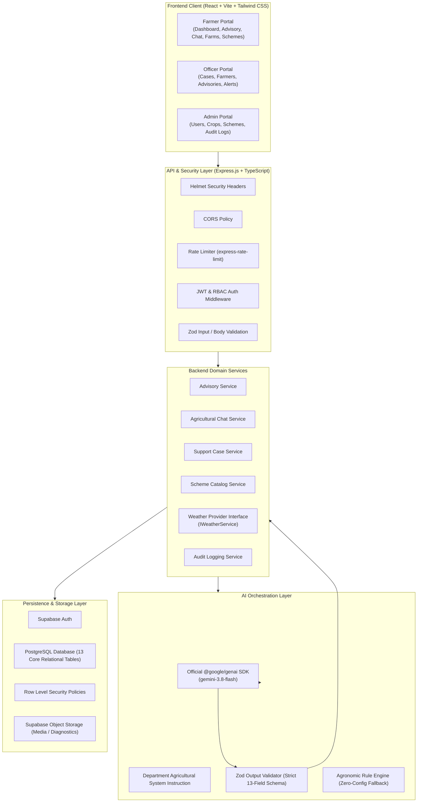

# KrishiSeva Architecture & System Design

## 1. Executive Summary

**KrishiSeva** is a production-grade, AI-powered Agriculture Department digital platform designed to bridge the gap between farmers, field agriculture extension officers, and departmental administrators. The platform combines intelligent crop advisory, disease diagnostics, weather-aware agronomy, and government scheme accessibility with administrative oversight and case management.

---

## 2. High-Level System Architecture



---

## 3. Monorepo Organization

The project follows a standard workspace architecture:

```text
krishiseva/
├── apps/
│   ├── web/                    # React 18 + Vite + Tailwind CSS + TanStack Query
│   │   ├── src/
│   │   │   ├── components/     # Reusable UI & agricultural components
│   │   │   ├── contexts/       # AuthContext with 1-click role switcher
│   │   │   ├── lib/            # Centralized API fetch client
│   │   │   ├── pages/          # 30+ pages organized by portal (farmer, officer, admin, public)
│   │   │   ├── routes/         # Protected routes & AppShell routing
│   │   │   ├── types/          # Client-side domain contracts
│   │   │   └── main.tsx        # Application root entrypoint
│   │   └── package.json
│   │
│   └── api/                    # Node.js + Express + TypeScript Backend Service
│       ├── src/
│       │   ├── ai/             # Official @google/genai orchestration & system prompts
│       │   ├── config/         # Strongly typed env configuration
│       │   ├── controllers/    # Domain HTTP controllers
│       │   ├── integrations/   # Isolated weather provider adapter pattern
│       │   ├── middleware/     # Auth, RBAC, Rate limiter, Error handler, Validation
│       │   ├── repositories/   # Dual-mode database layer (Supabase + In-Memory Fallback)
│       │   ├── routes/         # REST API route handlers
│       │   ├── schemas/        # Centralized Zod request & AI response schemas
│       │   ├── types/          # Backend TypeScript interfaces
│       │   ├── utils/          # Structured logger with PII sanitization
│       │   ├── app.ts          # Express application factory
│       │   └── server.ts       # Server lifecycle & graceful shutdown
│       └── package.json
│
├── supabase/
│   ├── migrations/             # Production PostgreSQL DDL & RLS policies
│   ├── seed.sql                # Realistic seed data (crops, schemes, alerts)
│   └── config.toml             # Local Supabase CLI configuration
│
├── docs/                       # Comprehensive engineering documentation
│   ├── architecture.md
│   ├── api.md
│   ├── database.md
│   ├── security.md
│   ├── ai.md
│   └── deployment.md
│
├── tests/                      # Unit & integration test suites
│   ├── unit/
│   └── integration/
│
├── .github/
│   └── workflows/
│       ├── ci.yml              # Multi-step CI quality pipeline
│       └── deploy.yml          # Containerized CD workflow
│
├── Dockerfile                  # Multi-stage production container build
├── docker-compose.yml          # Local multi-container development environment
├── .env.example                # Documented configuration template
├── package.json                # Root package with monorepo scripts
└── README.md                   # Main project overview & instructions
```

---

## 4. User Journeys & Workflows

### 4.1 Farmer Journey
1. **Onboarding:** Farmer registers with name, phone, district, and experience.
2. **Farm & Field Asset Registration:** Adds farms and cadastral field boundaries with soil type, pH, and irrigation setup.
3. **Advisory Request:** Initiates crop advisory by choosing farm, crop stage, symptoms, and weather context.
4. **AI Generation & Verification:** Gemini generates structured advice adhering to the 13-field schema. If risk is elevated, the platform automatically recommends officer review.
5. **Escalation to Support Case:** If assistance is needed, the farmer creates a case that directly routes to assigned agricultural officers.

### 4.2 Agriculture Officer Journey
1. **Triage:** Officer reviews incoming cases in their district on `/officer/cases`.
2. **AI Briefing:** The officer reads an automated AI summary highlighting key facts, symptom urgency, and suggested field inspection questions.
3. **Field Assessment & Notes:** The officer updates the case with human-verified agricultural recommendations and resolution directives.
4. **Advisory Audit:** Audits algorithmic recommendations issued to farmers in their jurisdiction to catch deviations.
5. **Alert Publishing:** Issues regional advisories for pests (e.g. Fall Armyworm, Yellow Rust) or weather alerts.

### 4.3 Administrator Journey
1. **User & Officer Management:** Grants roles, activates/suspends accounts, and assigns officers to districts.
2. **Master Catalog Maintenance:** Updates crop agronomic baselines, sowing windows, and soil requirements.
3. **Scheme Directory Management:** Curates government subsidy schemes with eligibility criteria, application documents, and official portal links.
4. **Security & Audit Logs:** Audits authentication events, advisory runs, and administrative mutations.
5. **System Telemetry:** Monitors API uptime, AI latency, and database connection status.

---

## 5. Technology Stack Rationale

| Layer | Selection | Justification |
| :--- | :--- | :--- |
| **Frontend** | React 18, Vite, TypeScript | Fast bundling, modern hooks, strict typing across all components. |
| **Styling** | Tailwind CSS | Clean government-portal aesthetic, responsive, high contrast, mobile-first. |
| **Data Fetching** | TanStack Query v5 | Automated caching, optimistic mutations, window focus refetching. |
| **Form UX** | React Hook Form + Zod | Low re-renders, client-side validation parity with backend schemas. |
| **Backend** | Node.js, Express, TypeScript | Non-blocking I/O, rich ecosystem, modular middleware pipeline. |
| **AI SDK** | `@google/genai` | Official Google Gemini SDK with direct integration for `gemini-3.8-flash`. |
| **Database** | PostgreSQL / Supabase | Relational integrity, JSONB support for unstructured agronomy data, native RLS. |
| **Security** | Helmet, express-rate-limit | Defends against common web vulnerabilities, brute-force, and DDoS. |

---

## 6. Extensibility Architecture

### Weather Integration
The weather service is completely decoupled through the `IWeatherService` interface in `apps/api/src/integrations/weather.ts`. Swapping providers (e.g. IMD, OpenWeatherMap, AccuWeather) requires zero modifications to controller or advisory logic.

### Notification Gateway
The in-app notification repository is built with an event-driven abstraction ready to plug in SMS gateways (NIC SMS Gateway, Twilio) or WhatsApp Business API for rural farmers who rely on SMS.
