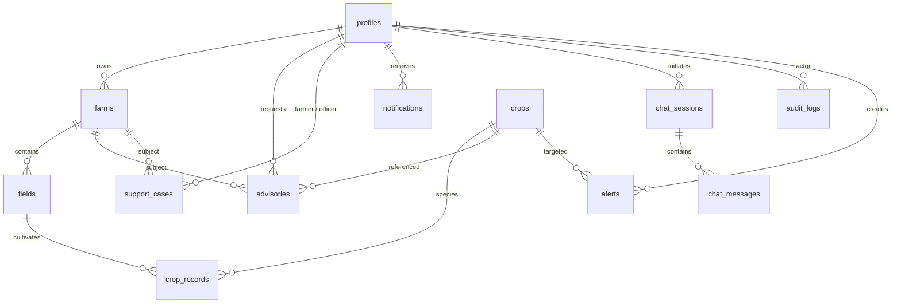

# KrishiSeva Database Architecture & Schema Specification

## 1. Relational Database Overview

KrishiSeva utilizes **PostgreSQL** (managed via **Supabase**) as its primary relational store. The schema is organized into 13 core tables designed with strict referential integrity, foreign key cascading rules, check constraints, JSONB validation, and automated `updated_at` trigger functions.

---

## 2. Entity Relationship Diagram



---

## 3. Complete Table Definitions

### 3.1 `profiles`
Stores user identity, role, and geographic demographics.
- `id` (UUID, PK): References `auth.users(id)` ON DELETE CASCADE.
- `full_name` (TEXT, NOT NULL): Farmer or officer legal name.
- `phone` (TEXT): Primary contact number.
- `role` (TEXT, NOT NULL): Restricted to `CHECK (role IN ('FARMER', 'OFFICER', 'ADMIN'))`.
- `preferred_language` (TEXT, DEFAULT `'en'`).
- `state` (TEXT), `district` (TEXT), `taluka` (TEXT), `village` (TEXT).
- `farming_experience` (INTEGER): Years in farming.
- `created_at`, `updated_at` (TIMESTAMPTZ).

### 3.2 `farms`
Stores agricultural landholdings.
- `id` (UUID, PK): `gen_random_uuid()`.
- `owner_id` (UUID, FK): References `profiles(id)` ON DELETE CASCADE.
- `name` (TEXT, NOT NULL): Farm name.
- `location_text` (TEXT), `state` (TEXT), `district` (TEXT), `taluka` (TEXT), `village` (TEXT).
- `area` (NUMERIC), `area_unit` (TEXT, DEFAULT `'acre'`).
- `irrigation_type` (TEXT), `soil_type` (TEXT).
- `soil_ph` (NUMERIC): Range `CHECK (soil_ph >= 0 AND soil_ph <= 14)`.
- `created_at`, `updated_at` (TIMESTAMPTZ).

### 3.3 `fields`
Cadastral sub-divisions within a farm.
- `id` (UUID, PK): `gen_random_uuid()`.
- `farm_id` (UUID, FK): References `farms(id)` ON DELETE CASCADE.
- `name` (TEXT, NOT NULL).
- `area` (NUMERIC).
- `soil_type` (TEXT), `soil_ph` (NUMERIC), `irrigation_type` (TEXT).
- `created_at`, `updated_at` (TIMESTAMPTZ).

### 3.4 `crops`
Master agricultural catalog of cultivated species.
- `id` (UUID, PK): `gen_random_uuid()`.
- `name` (TEXT, NOT NULL).
- `scientific_name` (TEXT), `category` (TEXT), `description` (TEXT).
- `growing_season` (TEXT): e.g. Kharif, Rabi, Zaid, Perennial.
- `soil_requirements` (JSONB), `water_requirements` (JSONB).
- `created_at`, `updated_at` (TIMESTAMPTZ).

### 3.5 `crop_records`
Active sowing cycles on specific fields.
- `id` (UUID, PK): `gen_random_uuid()`.
- `field_id` (UUID, FK): References `fields(id)` ON DELETE CASCADE.
- `crop_id` (UUID, FK): References `crops(id)`.
- `variety` (TEXT), `sowing_date` (DATE), `expected_harvest_date` (DATE).
- `growth_stage` (TEXT): e.g. Germination, Tillering, Flowering, Maturity.
- `status` (TEXT, DEFAULT `'ACTIVE'`): `CHECK (status IN ('ACTIVE', 'HARVESTED', 'FAILED', 'PLANNED'))`.
- `created_at`, `updated_at` (TIMESTAMPTZ).

### 3.6 `advisories`
Persisted AI crop recommendations and diagnostics.
- `id` (UUID, PK): `gen_random_uuid()`.
- `farmer_id` (UUID, FK): References `profiles(id)` ON DELETE CASCADE.
- `farm_id` (UUID, FK): References `farms(id)` ON DELETE SET NULL.
- `field_id` (UUID, FK): References `fields(id)` ON DELETE SET NULL.
- `crop_id` (UUID, FK): References `crops(id)` ON DELETE SET NULL.
- `question` (TEXT).
- `input_data` (JSONB, NOT NULL): Full snapshot of farmer input context.
- `ai_response` (JSONB, NOT NULL): Validated 13-field AI output.
- `risk_level` (TEXT): `CHECK (risk_level IN ('LOW', 'MEDIUM', 'HIGH', 'UNKNOWN'))`.
- `confidence` (NUMERIC): Model confidence score [0.0 - 1.0].
- `model_name` (TEXT): e.g. `gemini-3.8-flash`.
- `status` (TEXT, DEFAULT `'COMPLETED'`).
- `created_at` (TIMESTAMPTZ).

### 3.7 `support_cases`
Officer case management workflow.
- `id` (UUID, PK): `gen_random_uuid()`.
- `case_number` (TEXT, UNIQUE, NOT NULL): Formatted as `CASE-YYYY-XXXX`.
- `farmer_id` (UUID, FK): References `profiles(id)` ON DELETE CASCADE.
- `farm_id` (UUID, FK): References `farms(id)` ON DELETE SET NULL.
- `assigned_officer_id` (UUID, FK): References `profiles(id)` ON DELETE SET NULL.
- `category` (TEXT, NOT NULL), `priority` (TEXT, DEFAULT `'MEDIUM'`).
- `description` (TEXT, NOT NULL).
- `ai_summary` (TEXT): Automated summarization generated for the officer.
- `officer_notes` (TEXT), `resolution` (TEXT).
- `status` (TEXT, DEFAULT `'OPEN'`): `CHECK (status IN ('OPEN', 'ASSIGNED', 'IN_REVIEW', 'WAITING_FOR_FARMER', 'RESOLVED', 'CLOSED'))`.
- `created_at`, `updated_at` (TIMESTAMPTZ).

### 3.8 `schemes`
Central government and state agricultural subsidy catalog.
- `id` (UUID, PK): `gen_random_uuid()`.
- `name` (TEXT, NOT NULL), `description` (TEXT, NOT NULL).
- `eligibility` (TEXT), `benefits` (TEXT).
- `required_documents` (JSONB): Array of document names.
- `application_information` (TEXT), `department` (TEXT), `state` (TEXT).
- `official_source` (TEXT): Verified government URL.
- `last_verified_at` (TIMESTAMPTZ).
- `is_active` (BOOLEAN, DEFAULT true).
- `created_at`, `updated_at` (TIMESTAMPTZ).

### 3.9 `alerts`
Regional pest, disease, and weather warnings.
- `id` (UUID, PK): `gen_random_uuid()`.
- `title` (TEXT, NOT NULL), `description` (TEXT, NOT NULL).
- `category` (TEXT, NOT NULL), `severity` (TEXT, NOT NULL): `CHECK (severity IN ('LOW', 'MEDIUM', 'HIGH', 'CRITICAL'))`.
- `state` (TEXT), `district` (TEXT).
- `crop_id` (UUID, FK): References `crops(id)` ON DELETE SET NULL.
- `starts_at` (TIMESTAMPTZ), `ends_at` (TIMESTAMPTZ).
- `is_published` (BOOLEAN, DEFAULT false).
- `created_by` (UUID, FK): References `profiles(id)`.
- `created_at`, `updated_at` (TIMESTAMPTZ).

### 3.10 `notifications`
User notification queue.
- `id` (UUID, PK): `gen_random_uuid()`.
- `user_id` (UUID, FK): References `profiles(id)` ON DELETE CASCADE.
- `title` (TEXT, NOT NULL), `message` (TEXT, NOT NULL).
- `type` (TEXT, NOT NULL): e.g. `ADVISORY`, `CASE_UPDATE`, `ALERT`, `SCHEME`.
- `read_at` (TIMESTAMPTZ, NULLABLE).
- `created_at` (TIMESTAMPTZ).

### 3.11 `audit_logs`
Tamper-evident platform activity audit log.
- `id` (UUID, PK): `gen_random_uuid()`.
- `actor_id` (UUID, FK): References `profiles(id)` ON DELETE SET NULL.
- `action` (TEXT, NOT NULL): e.g. `USER_LOGIN`, `ADVISORY_GENERATED`, `ROLE_CHANGED`.
- `entity_type` (TEXT), `entity_id` (UUID).
- `metadata` (JSONB), `ip_hash` (TEXT).
- `created_at` (TIMESTAMPTZ).

### 3.12 `chat_sessions` & 3.13 `chat_messages`
Multi-turn conversational agronomist sessions.
- `chat_sessions`: `id`, `user_id` (FK to profiles), `title`, `created_at`, `updated_at`.
- `chat_messages`: `id`, `session_id` (FK to chat_sessions), `role` (`'USER'` or `'ASSISTANT'`), `content`, `metadata` (JSONB), `created_at`.

---

## 4. Row Level Security (RLS) Policies

All user-sensitive tables enforce RLS in `supabase/migrations/20260925000001_row_level_security.sql`.

### Farmer Isolation
- Farmers can only SELECT, INSERT, UPDATE, or DELETE records where `owner_id = auth.uid()` or `farmer_id = auth.uid()`.
- Farmers cannot access another farmer's profile, farm, field, advisory, or support case.

### Officer Access
- Agriculture officers can view farmers, farms, and advisories within their assigned district.
- Officers can view and update support cases assigned to them or unassigned in their jurisdiction.

### Admin Privileges
- Admins possess system-wide SELECT and UPDATE access across master tables (`crops`, `schemes`, `alerts`, `audit_logs`).

---

## 5. Performance Indexes

```sql
CREATE INDEX idx_farms_owner ON farms(owner_id);
CREATE INDEX idx_fields_farm ON fields(farm_id);
CREATE INDEX idx_crop_records_field ON crop_records(field_id);
CREATE INDEX idx_advisories_farmer ON advisories(farmer_id);
CREATE INDEX idx_support_cases_farmer ON support_cases(farmer_id);
CREATE INDEX idx_support_cases_officer ON support_cases(assigned_officer_id);
CREATE INDEX idx_notifications_user ON notifications(user_id, read_at);
CREATE INDEX idx_alerts_region ON alerts(state, district) WHERE is_published = true;
CREATE INDEX idx_audit_logs_actor ON audit_logs(actor_id, created_at DESC);
```
